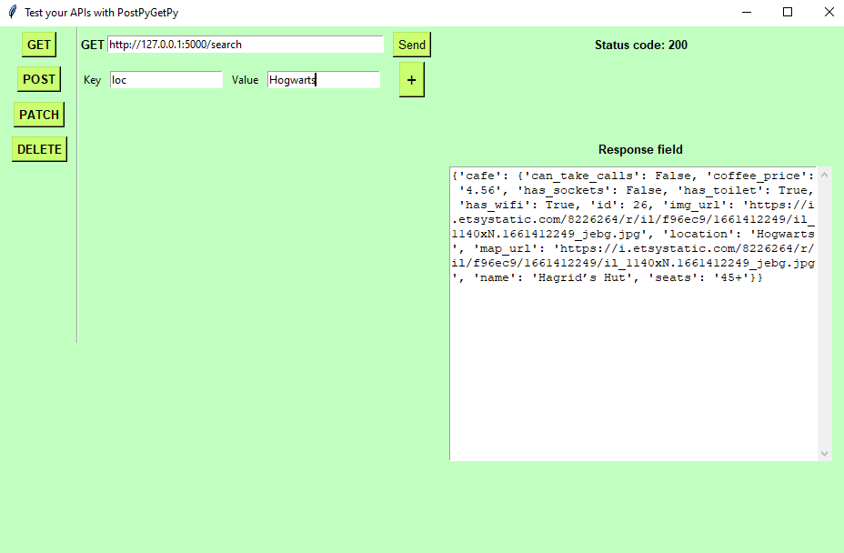
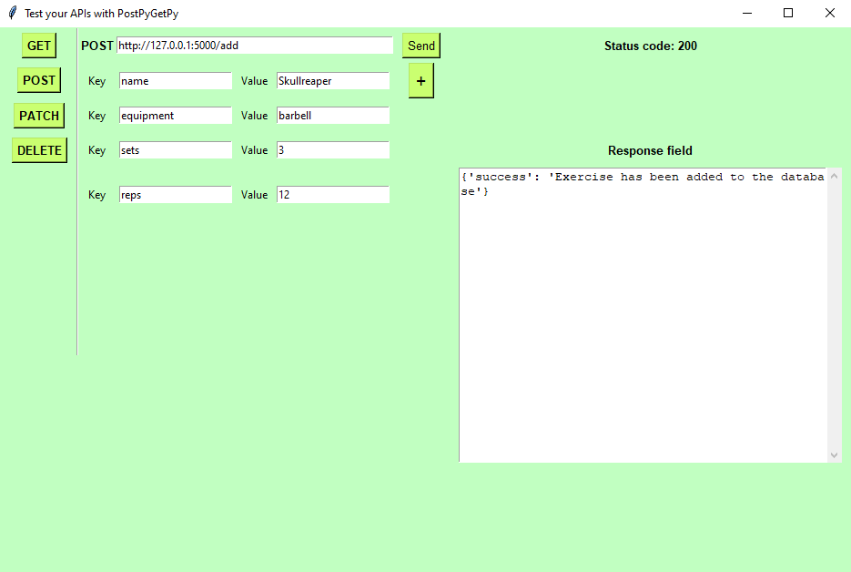
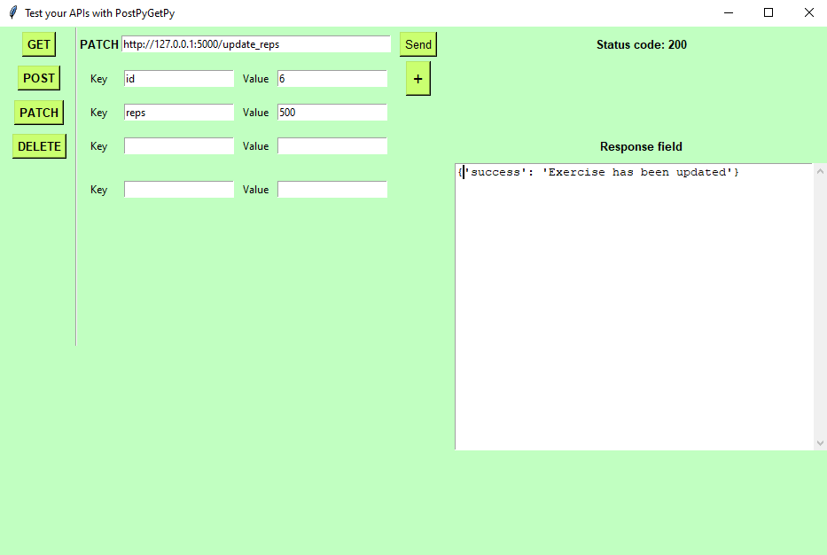
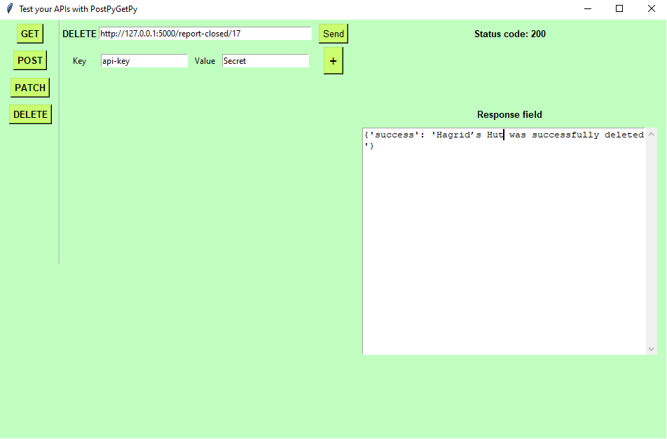

# GetPyPostPy
## Test local and APIs with Python only GUI
GetPyPostPy uses Tkinter for GUI interface and Python Requests module.

### Getting Started
You'll need a popular Requests package for sending HTTP/1.1 requests
pip install Requests package
**python -m pip install requests**

### Sending GET Requests
On the left there are four buttons for different types of requests. 
Clicking on the specific button will chnage the type of request that will be sent. The label next url field will change indicating which request is being sent.

New parameter fields can be added using + button. Unfortunately when you click on the + button it does not retain the values that were entered in previous fields. ***Therefore first create the number of parameter fields you want.*** I will try to make a fix for that in the future.

Click on GET Button and then enter your API endpoint URL in the top field. Then add the number of parameter fields you'll need for your GET request before adding values to the parameter fields. 

### Sending POST Requests
Click on POST Button and then enter your API endpoint URL in the top field. Then add the number of parameter fields you'll need for your POST request before adding values to the parameter fields. 

### Sending PATCH Requests
Click on PATCH Button and then enter your API endpoint URL in the top field. Then add the number of parameter fields you'll need for your PATCH request before adding values to the parameter fields. 

### Sending DELETE Requests
Click on DELETE Button and then enter your API endpoint URL in the top field. Then add the number of parameter fields you'll need for your DELETE request before adding values to the parameter fields. 

